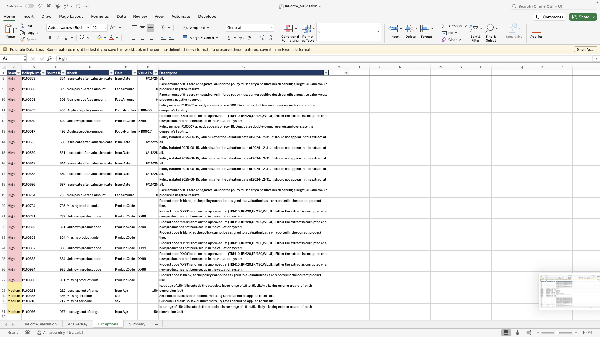
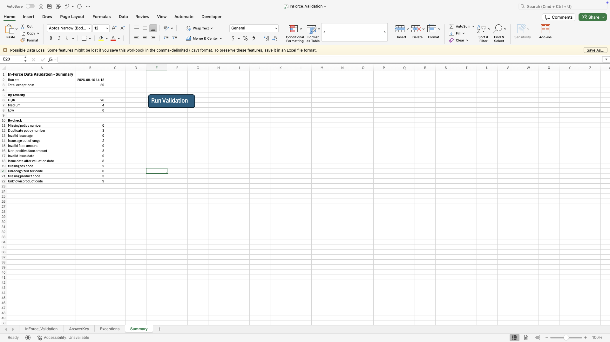
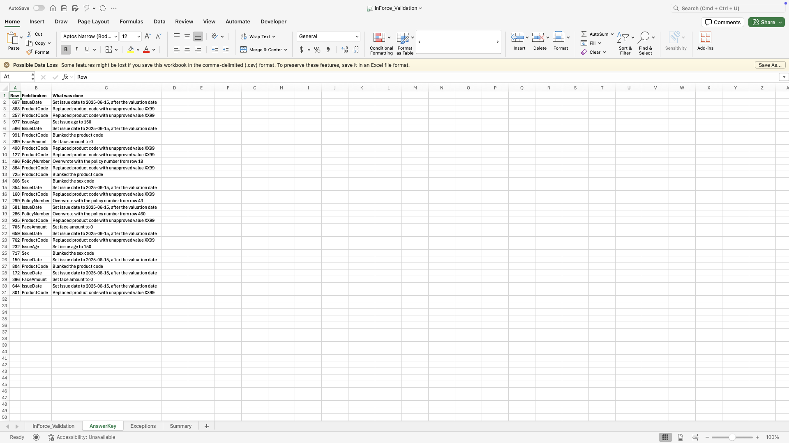

# In-Force Data Validation Tool

A VBA Excel macro that checks life insurance policy data for errors before it's
used in a valuation, applying six data-quality checks and producing a severity-ranked
exception report and summary dashboard. Tested on 1,000 synthetic policy records with
deliberately planted errors.

---

## Why I built this

I wanted a project that would build my knowledge of Excel/VBA and the insurance concepts actuaries use day to day.

Every reporting period, a life insurer runs a valuation meaning calculating policy
reserves and liabilities across its entire book of in-force business. That
calculation is only as trustworthy as the data feeding it: a duplicated policy
double-counts a reserve, a negative or zero face amount produces a nonsensical
liability, a policy dated *after* the valuation date shouldn't be in the extract at
all, and a missing sex code or unrecognized product code means no mortality rate or
valuation basis can be assigned. Errors like these are cheap to fix **before** the
run and expensive to chase down **after**.

This tool does that up-front scrub in VBA: it scans the extract, flags every record
that would break or distort the valuation, and ranks the findings so the reviewer
fixes the dangerous ones first — while giving me hands-on exposure to Excel's object
model, macro debugging, and real insurance data-quality logic.

## What it does

Point the tool at an `InForce` worksheet and it scans every policy row, applies six
data-quality checks, and writes two outputs:

- **`Exceptions`** — a severity-ranked, color-coded report. One row per problem
  found, with the policy number, source row, which check failed, the value in question,
  and a explanation of why it would harm the valuation in plain english.
- **`Summary`** — a one-glance dashboard: total exceptions, a breakdown by severity,
  and a breakdown by individual check (every check is listed, so a check that found
  nothing shows a **0** — proof it ran rather than silence). A **Run Validation**
  button on this sheet kicks off the scan.



## The six checks & severity scheme

Each finding gets tagged **High** or **Medium**:

- **High = stop and fix.** These break the valuation outright — double-counted reserves, negative liabilities, policies with no valid basis to run.
- **Medium = flag it, but you can still proceed.** Something looks off, but it won't crash the run.

| # | Check | What it catches | Severity |
|---|-------|------------------|----------|
| 1 | **Policy number** | Blank, or a duplicate of one already seen | High |
| 2 | **Issue age** | Missing/non-numeric, or outside 18–85 | Medium |
| 3 | **Face amount** | Missing/non-numeric, or zero/negative | High |
| 4 | **Issue date** | Missing/unreadable, or after the valuation date (2024-12-31) | High |
| 5 | **Sex code** | Blank, or not `M`/`F` | Medium |
| 6 | **Product code** | Blank, or not on the approved list (`TRM10`, `TRM20`, `TRM30`, `WL`, `UL`) | High |




## How I tested it

A validation tool is only useful if you can actually prove it catches what it's supposed to. So I built an error injector alongside it, not just the checker itself.

Here's the process:

1. Start with clean synthetic policy data on the `InForce` sheet.
2. Run `InjectErrors`. It breaks about 3% of the rows on purpose.  For example duplicating a policy number, zeroing out an age,
negating a face amount, post-dating an issue date, blanking a required field, or swapping in a bad product code.
5. Every break gets logged to an `AnswerKey` sheet — which row, which field, what exactly changed. This is the ground truth.
6. Run the validator and compare its `Exceptions` output against `AnswerKey`. Every injected error should show up, at the right row and severity.

Since the answer key comes from the same run that broke the data, there's no separate expected-output file to keep in sync by hand — the test checks itself.



## Input format

The tool expects a sheet named `InForce`, one policy per row, header row on top:

| Col | Field | Notes |
|-----|-------|-------|
| A | Policy Number | must be present and unique |
| B | Product Code | must be on the approved list |
| C | Sex | `M` or `F` |
| D | Issue Age | 18–85 |
| E | Issue Date | on or before the valuation date |
| F | Face Amount | positive |
| G | Annual Premium | carried through, not validated |

Sample data is in [`sample-data/`](sample-data/) as a CSV, so you can look at it without opening Excel.

## How to run it

1. Open `InForce_Validation.xlsm` and enable macros when prompted.
2. *(Optional, to reproduce the test)* Run `InjectErrors` (`Module1`) to break ~3% of the sample rows and build the `AnswerKey` sheet.
3. Run the validation — either click **Run Validation** on the `Summary` sheet, or press Alt+F11, then F5 on `RunDataChecks`.
4. Check the `Exceptions` report (worst issues first) and the `Summary` dashboard.

Config — valuation date, age band, approved product list, sheet names — lives in labelled constants at the top of `Module2`. Point it at a different book by changing those, not the check logic.


## Project structure

```
inforce-validation/
├── InForce_Validation.xlsm      # the working tool (macros enabled)
├── src/
│   ├── Module1_ErrorInjector.bas   # injects known errors + writes the AnswerKey
│   └── Module2_Validation.bas      # the six checks + report/summary output
├── sample-data/                 # CSV extract(s) for inspection without Excel
├── screenshots/                 # output examples
├── LICENSE
└── README.md
```

## License

Released under the [MIT License](LICENSE).
